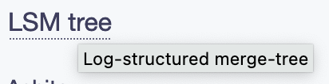
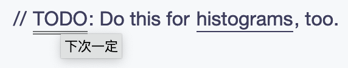
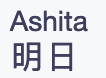

- 开始污染 markdown 吧！
- # heti enhancement
- 缩写
	- ```html
	  <abbr title="Log-structured merge-tree">LSM tree</abbr>
	  ```
	- 
- 注解1
	- ```html
	  // <u title="下次一定">TODO</u>: Do this for <u>histograms</u>, too.
	  ```
	- 
- 注解2
	- ```html
	  <div class="heti heti--annotation">
	    <ruby>
	    	明日 <rt>Ashita</rt>
	    </ruby>
	  </div>
	  ```
	- 
- 强调
	- ```html
	  <span class="heti-em">打麻</span>将
	  ```
	- 
- 多栏排版
	- ```html
	  <div class="heti heti--columns-2">
	    可以是 2 ，3 或 4 列
	  </div>
	  ```
- 竖式排版
	- ```html
	  <div class="heti heti--vertical">
	    不知道什么时候用得上
	  </div>
	  ```
-