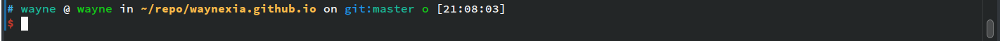

- personal oh-my-zsh config
- ## oh-my-zsh
- ```bash
  # arch
  yay oh-my-zsh-git
  /usr/share/oh-my-zsh/tools/install.sh
  ```
- ## Theme
- `powerlevel10k`
	- https://github.com/romkatv/powerlevel10k
	- 
	- Installation
		- Font
			- ```bash
			  # arch
			  yay ttf-meslo-nerd-font-powerlevel10k
			  ```
		- ```bash
		  git clone --depth=1 https://github.com/romkatv/powerlevel10k.git ${ZSH_CUSTOM:-$HOME/.oh-my-zsh/custom}/themes/powerlevel10k
		  ```
		- Set `ZSH_THEME="powerlevel10k/powerlevel10k"` in `~/.zshrc`.
- ## Plugin
- zsh-autosuggestions
	- https://github.com/zsh-users/zsh-autosuggestions
	- ```bash
	  git clone https://github.com/zsh-users/zsh-autosuggestions ${ZSH_CUSTOM:-~/.oh-my-zsh/custom}/plugins/zsh-autosuggestions
	  ```
- fast-syntax-highlighting
	- https://github.com/zdharma-continuum/fast-syntax-highlighting
	- ```bash
	  git clone https://github.com/zdharma-continuum/fast-syntax-highlighting.git ${ZSH_CUSTOM:-~/.oh-my-zsh/custom}/plugins/fast-syntax-highlighting
	  ```
- zsh-z
	- https://github.com/agkozak/zsh-z
	- ```bash
	  git clone https://github.com/agkozak/zsh-z ${ZSH_CUSTOM:-~/.oh-my-zsh/custom}/plugins/zsh-z
	  ```